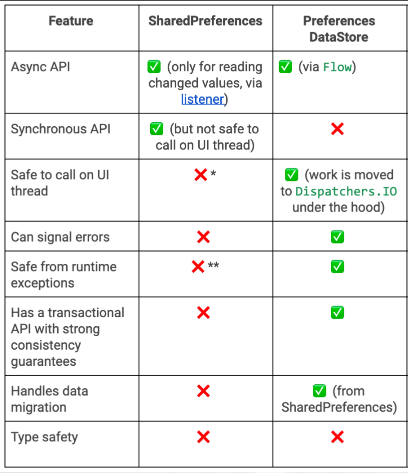

"# SPtoDataStorePreferences" 

->Why Jetpack DataStore?
->SharedPreferences vs DataStore Preferences
->Migration from SharedPreferences to DataStore Preferences
->Implementation in DEMO Project

1.Why JetPack DataStore?
--> Jetpack DataStore is a new and improved data storage solution aimed at replacing SharedPreferences.
    It is built on Kotlin Coroutines and Flow and is safe to use on UI Thread.
    Data is stored asynchronously, consistently, and transactionally, overcoming most of the drawbacks of SharedPreferences.
    Implementation of Jetpack DataStore does not encourage the reading of the data on UI Thread. 
    Datastore can signal errors and is safe from runtime exceptions(parsing errors)
Preferences DataStore: Stores data in key-value pairs similar to Shared Preferences.
                       It doesn’t provide any type-safety. 
                       No predefined schema is required.
2.Shared Preferences vs Datastore Preferences
-->Consistency is guaranteed in DataStore Preferences.
   Error handling is supported in DataStore Preferences.
   DataStore Preferences support Kotlin Coroutines Flow API by default.
   

3.Migration from SharedPreferences to DatastorePreferences
-->DataStore provides a simpler way for migrating from SharedPreferences. 
   SharedPreferencesMigration is a DataMigration instance for migrating from SharedPreferences to DataStore. 
   While building the datastore we just need to pass the SharedPreferences name to SharedPreferencesMigration.
   And SharedPreferencesMigration instance needs to be added to Datastore builder.

IMPORTANT:However, Migrations should run before any data access can occur in DataStore. Our migration must be
          succeeded before reading any data using DataStore.data and before updating any data usingDataStore.updateData()

4.Implementation in DEMO Project:
-->A. So we have create one dummy shared preferences with two keys: 1. Username
                                                                    2. Password
   B. Here, we have a manager class MigrationManager which is responsible for the migration.In this we have methods to migrate
      the shared preferences,to read the shared preferences and edit the shared preferences.
   C. As mentioned earlier, Migrations should run before any data access or data edit  can occur in Datastore.So at we have created 
      MainApplication class (which extends Application Class) where we are creating Migration Manager class object to initiate migration.
   D. At UI level: 1.we have 2 Textviews to display username and passwords.
                   2.2 buttons: Read Datastore preferences and Edit Datastore preferences.
   -->When will click read datastore for very first time, will read the values stored in newly created datastore(migrated from 
      shared preferenes)
   -->Now, if we want to edit values in datastore,write that values in textviews and click edit datastore,datastore will get 
      updated with latest values
   -->Now if we want to read datastore again, will read the latest values edited in datastore.